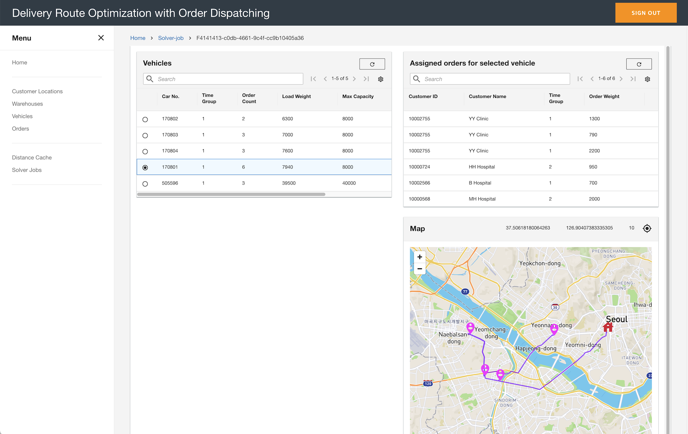

# Optimize Delivery Route and Order Dispatching for Nextday Delivery Service



## Introduction

물류 서비스에서 당일/익일 배송 주문을 **어떤 차량에 어떻게 배분하고, 어떤 순서로 실제 도로를 따라 운행할 것인가** 는 고전적이지만 여전히 어려운 문제입니다.
차량 적재량, 고객 우선순위, 시간대(time window), 자차/계약 차량 구분 같은 다양한 비즈니스 제약을 동시에 만족시키면서도 실제 주행 거리 관점에서 최적에 가까운 경로를 찾아야 하기 때문입니다.

이 프로젝트는 그 문제를 해결하기 위한 **샘플 애플리케이션** 입니다.

- **문제 영역**: 익일 배송(next-day delivery) 서비스의 **주문 배차(dispatching)** 와 **경로 최적화(route optimization)**
- **해법**
  - [OptaPlanner](https://www.optaplanner.org/) 로 다목적(hard/medium/soft) 스코어 기반 VRPTW 형태의 최적화 문제를 풀고
  - [GraphHopper](https://www.graphhopper.com/) + OSM 데이터로 **실제 도로 그래프** 기반의 거리/소요시간을 계산하며
  - AWS 인프라 ([AWS CDK](https://aws.amazon.com/cdk/) 로 정의) 위에서 서버리스/ECS 로 실행되고, React 기반 Web UI 에서 결과를 시각화합니다.

결과적으로 운영자는 매일 발생하는 주문을 업로드한 뒤, 웹 UI에서 차량별 배차 결과와 지도 위 실제 주행 경로를 즉시 확인할 수 있습니다.

---

## Demo Scenario

포함된 샘플 데이터는 **서울 지역 병원으로의 의료품 당일 배송** 시나리오를 기반으로 합니다.

**시나리오**
- 고객은 서울 지역의 병원들이며 매일 의료품을 주문합니다.
- 주문은 하루에 한 번 일괄 배차됩니다.
- 모든 배송은 하나의 창고(warehouse) 에서 출발합니다.
- 고객마다 배송 우선순위가 있습니다.
- 한 고객이 여러 주문을 넣을 수 있습니다.
- 기본적으로 자차(company-owned vehicle) 로 배송하며, 주문이 많은 날에는 임시 계약 차량(contracted vehicle) 도 사용합니다.

**비즈니스 제약 (Business Considerations)**
- 주문은 차량 적재 용량(capacity)을 고려해 배차됩니다.
- 총 주행 거리를 최소화합니다.
- 주문은 반드시 **고객의 time group 보다 빠른 time group** 을 가진 차량이 배송해야 합니다.
- 동일 고객의 여러 주문은 가급적 한 대의 차량이 한 번에 처리합니다.
- 자차 차량이 우선 배정되고, 모든 자차가 포화 상태일 때만 임시 계약 차량이 투입됩니다.

이 시나리오와 데이터(`apps_infra/scripts/data/sample_order.csv`) 를 바탕으로 배포된 환경에서 최적화 결과를 재현할 수 있습니다. 재현 절차는 [Quickstart §3 Run Demo](./docs/quickstart.md#3-run-demo) 를 참고하세요.

---

## Documentation

* [Quickstart Guide](./docs/quickstart.md)
  * 요구사항 / 기술 스택 버전 정리
  * AWS 크레덴셜 설정, 빌드(Optimization Engine → Web → Infra) 및 배포
  * 데모 실행(Master data 업로드 → Distance cache → 주문 업로드) 및 Uninstall

* [Architecture](./docs/architecture.md)
  * Solution Architecture 다이어그램
  * Domain Model

## Project Governance

* [`CHANGELOG.md`](./CHANGELOG.md) — 버전별 변경 이력
* [`CONTRIBUTING.md`](./CONTRIBUTING.md) — 버그 리포트·PR 작성 가이드
* [`CODE_OF_CONDUCT.md`](./CODE_OF_CONDUCT.md) — Amazon Open Source Code of Conduct
* [`LICENSE`](./LICENSE) — MIT-0
* [`LICENSE_THIRDPARTY.txt`](./LICENSE_THIRDPARTY.txt) — 각 워크스페이스가 사용하는 모든 npm / Maven / Gradle 의존성의 라이선스 목록

---

## Repository Layout

```
.
├── apps_opt_engine/   # Optimization Engine (Java 21 + Spring Boot + OptaPlanner + GraphHopper)
├── apps_web/          # Web App (React 19 + Vite + Cloudscape + MapLibre)
├── apps_infra/        # Infrastructure-as-Code (AWS CDK + TypeScript, pnpm 단일 패키지)
└── docs/              # 프로젝트 문서 (quickstart, architecture, 이미지)
```

---

## References

This sample project referes [AWS Last Mile Delivery Hyperlocal - Last Mile Logistics](https://github.com/aws-samples/aws-last-mile-delivery-hyperlocal).

## License

This sample project is licensed under the MIT-0. See the LICENSE file.
