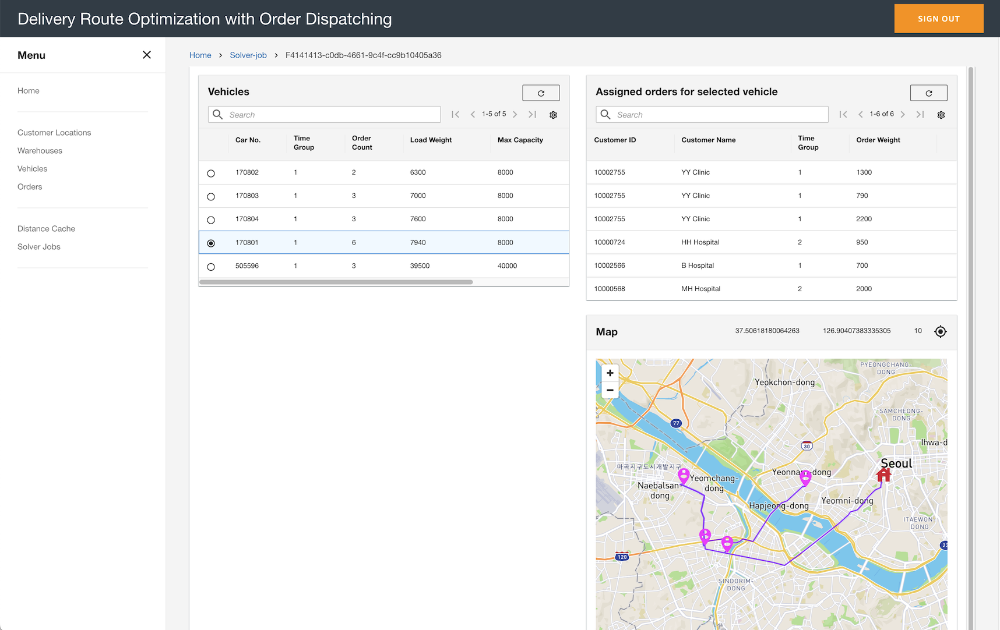
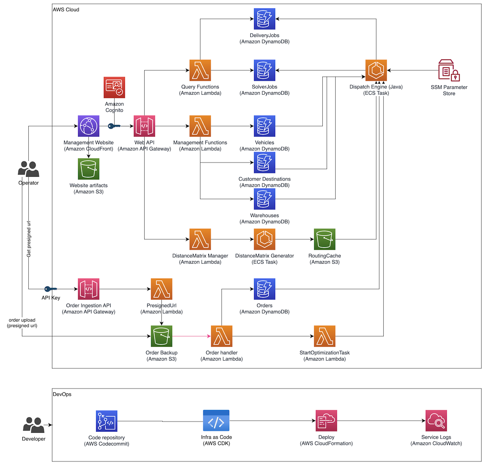

# Optimize Delivery Route and Order Dispatching for Nextday Delivery Service

## Introduction

This sample project provides you to demonstrate delivery order dispatching and route optimization application. In general logistics services, there are complex business considerations. And finding featable route for dispatching order usually rely on real drive-way on map. 

This project uses the [AWS CDK](https://aws.amazon.com/cdk/) to configure the infrastructure. The backend is consisted with [AWS Serverless Services](https://aws.amazon.com/serverless/) for an agile and flexible start, and the [Northstar design system](https://github.com/aws/aws-northstar) used for UI to display the optimization results.

## Demo Scenerio

This project includes sample order data about delivering medical supplies. See below document for more details.

* [Demo Scenerio Details](./docs/demo_scenerio.md)

### Screenshot


---

## Getting Started

* [Quickstart guide](./docs/quickstart.md)
* [Uninstall](./docs/content/screenshots.md)

## Architecture

### Solution Architecture



### Folder structure
```
.
├── apps
    ├── infra (cdk application to deploy cloud resources)
    ├── scripts (scripts for local development)
    └── website (web app)
├── docs (detailed documentation)
├── opt_engine (optimization engine)
└── packages
    ├── @config (project config related packages)
    └── @infra (lerna packages for infra deloyment)
```

---

## Requirements

### Dev Tools

* `nvm` with nodejs `v16` installed
* `yarn`
* `docker`
* `zip`
* `jq`
* `openjdk` version `v11` or higher
* `vscode` with `eslint` plugin (preferred)

### AWS

* AWS Account Access ([setup](https://aws.amazon.com/premiumsupport/knowledge-center/create-and-activate-aws-account/)) with enough permission to deploy the application
* [AWS CLI version 2](https://docs.aws.amazon.com/cli/latest/userguide/install-cliv2.html) with [named profile setup](https://docs.aws.amazon.com/cli/latest/userguide/cli-configure-profiles.html)

### Map Integration
* [Mapbox API token](https://docs.mapbox.com/accounts/guides/tokens/) needed for displaying map in the web. 

---

## References

This sample project referes [AWS Last Mile Delivery Hyperlocal - Last Mile Logistics](https://github.com/aws-samples/aws-last-mile-delivery-hyperlocal).

## License

This sample project is licensed under the MIT-0. See the LICENSE file.
