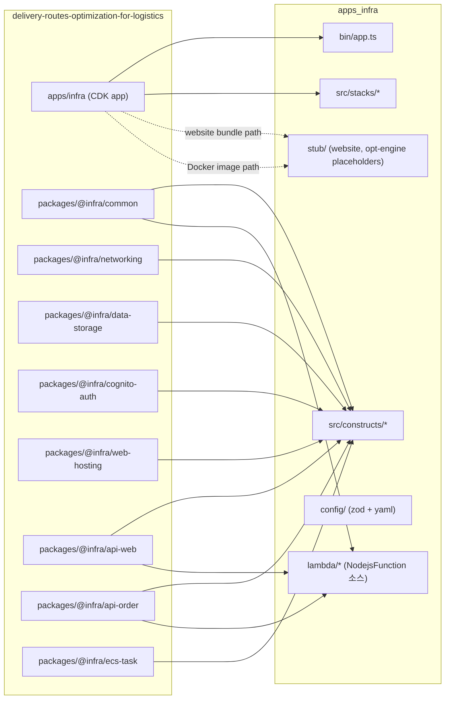
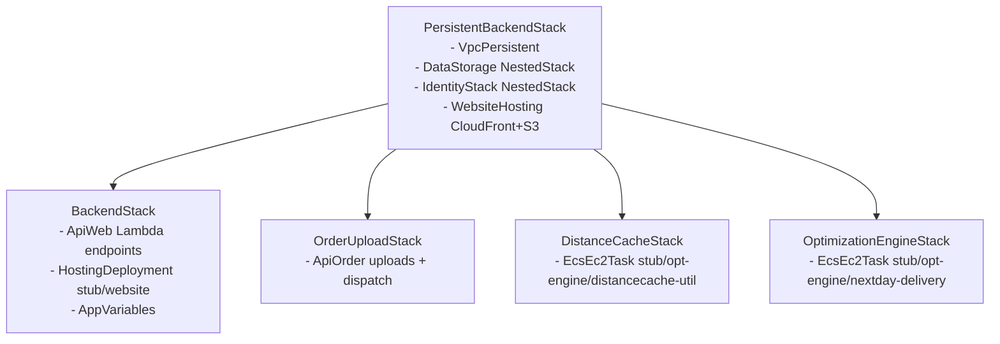
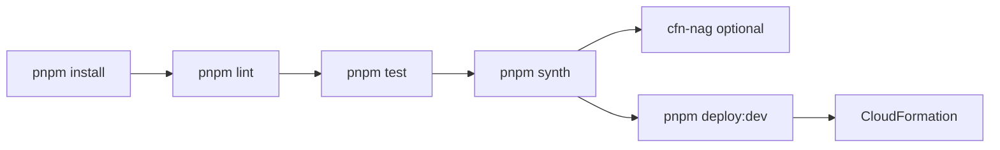

# Design — Infra Migration

> 대상: `delivery-routes-optimization-for-logistics/apps/infra` (monorepo 내부 8개 `@infra/*` 패키지에 의존하는 CDK 앱) 를 **`apps_infra/`** 단일 pnpm 패키지로 재작성.
>
> 본 문서는 [apps_infra/docs/migration-decisions.md](../../../docs/migration-decisions.md) 의 확정 답변(D1~D10) 을 전제로 작성되었습니다.

## 0. 결정 사항 요약

| ID | 결정 |
| --- | --- |
| D1 | **옵션 A 확장 — 소스 인라인 + 재설계**. Lambda 는 `NodejsFunction` 으로 전면 재작성하고 CDK 코드와 별개 폴더(`lambda/`) 에서 관리 |
| D2 | **Stub 대체**. `apps_infra/stub/website/` (static `index.html`), `apps_infra/stub/opt-engine/{distancecache-util, nextday-delivery}/Dockerfile` (nginx health-check) 생성 후 나중에 실제 빌드 산출물로 교체 |
| D3 | **옵션 B — Zod 기반 자작 config 로더**. `yaml` + `zod` + `dotenv`, `default.yml` 포맷은 유지 |
| D4 | **`lambda.Runtime.NODEJS_24_X` enum 사용**. CDK 2.252 가 지원하므로 `Runtime.of('nodejs24.x', ...)` 불필요 |
| D5 | **빈 `cdk.context.json`** 으로 초기화 |
| D6 | **Jest 29 + ts-jest 29** |
| D7 | **점진 단계 (tasks.md 단위)** |
| D8 | **사전 호환성 체크리스트** 적용 |
| D9 | **pnpm scripts + CDK CLI 직접 호출** |
| D10 | TS 5.6 / engines `node >=20 <25, pnpm >=9` / SPDX 헤더 유지 / `@typescript-eslint` 표준 재구성 / README 신설 |

---

## 1. High-Level Design

### 1.1 목표 및 비목표

**목표**
- `apps/infra` 가 만들어 내는 5개 CDK 스택(Persistent, Backend, OrderUpload, DistanceCache, OptimizationEngine) 을 동일한 책임으로 `apps_infra/` 에서 재현.
- 패키지 매니저 pnpm, 단일 패키지 구조, lerna·yarn-workspaces 제거.
- AWS CDK `2.252.0`, Node.js 24, TypeScript 5.6 로 라이브러리 버전 일괄 업그레이드.
- Lambda 는 `aws-cdk-lib/aws-lambda-nodejs` 의 `NodejsFunction` 으로 전면 재작성(소스 → esbuild 번들).
- Website / opt-engine 의존성은 stub 으로 대체하고 차후 실서비스 빌드와 교체.

**비목표**
- `apps/website`(React) 와 `apps/opt-engine`(Java) 런타임 코드 마이그레이션.
- `packages/@config/*` (eslint/commitlint/hygen preset) 의 이식 — 새 단일 패키지 표준으로 재구성.
- 실제 AWS 계정으로의 배포 자동화(CI/CD) 설계. 로컬/개발자 배포를 기본 전제로 한다.
- 테스트 커버리지 목표치 설정.

### 1.2 마이그레이션 전략 한눈에



### 1.3 타겟 디렉토리 구조

```
apps_infra/
├── .kiro/
│   ├── specs/infra-migration/
│   │   ├── design.md
│   │   ├── requirements.md   (design → requirements 순으로 이후 생성)
│   │   ├── tasks.md
│   │   └── .config.kiro
│   └── steering/             (필요 시 팀 규칙 추가)
├── docs/
│   └── migration-decisions.md
├── bin/
│   └── app.ts                # CDK 앱 엔트리포인트 (기존 dev-infra.ts 대체)
├── src/
│   ├── config/               # yaml + zod 로더
│   │   ├── index.ts
│   │   ├── schema.ts
│   │   └── loader.ts
│   ├── constants.ts          # LAMBDA_RUNTIME, STACK_NAMES 등 공용 상수
│   ├── constructs/
│   │   ├── common/           # namespaced, retainResource, PolicyStatements, RestApi helpers
│   │   ├── networking/       # VpcPersistent
│   │   ├── data-storage/     # DataStorage (NestedStack)
│   │   ├── cognito-auth/     # IdentityStack (NestedStack)
│   │   ├── web-hosting/      # WebsiteHosting, HostingDeployment, AppVariables
│   │   ├── api-web/          # ApiWeb (Lambda 참조는 @lambda 경로)
│   │   ├── api-order/        # ApiOrder
│   │   └── ecs-task/         # EcsEc2Task
│   └── stacks/
│       ├── PersistentBackendStack.ts
│       ├── BackendStack.ts
│       ├── OrderUploadStack.ts
│       ├── DistanceCacheStack.ts
│       └── OptimizationEngineStack.ts
├── lambda/                   # NodejsFunction 대상 TypeScript 소스 (src 와 분리)
│   ├── api-order/
│   │   ├── get-s3-presigned-url/index.ts
│   │   ├── create-order-batch/index.ts
│   │   └── start-order-dispatch-task/index.ts
│   └── api-web/
│       ├── customer-location-manager/index.ts
│       ├── warehouse-manager/index.ts
│       ├── vehicle-manager/index.ts
│       ├── orders-query/index.ts
│       ├── solver-job-query/index.ts
│       ├── delivery-jobs-query/index.ts
│       ├── delivery-job-by-solver-job-query/index.ts
│       ├── distance-cache-query/index.ts
│       ├── rebuild-distance-cache/index.ts
│       └── get-s3-presigned-url/index.ts
├── stub/
│   ├── website/              # index.html 하나만 (BackendStack 의 HostingDeployment 용)
│   │   └── index.html
│   └── opt-engine/
│       ├── distancecache-util/Dockerfile   # nginx health-check
│       └── nextday-delivery/Dockerfile     # nginx health-check
├── config/
│   └── default.yml           # 기존 포맷 유지, Zod 스키마로 검증
├── test/
│   ├── stacks/
│   │   ├── PersistentBackendStack.spec.ts
│   │   ├── BackendStack.spec.ts
│   │   ├── OrderUploadStack.spec.ts
│   │   ├── DistanceCacheStack.spec.ts
│   │   └── OptimizationEngineStack.spec.ts
│   └── config/schema.spec.ts
├── .gitignore
├── .eslintrc.cjs
├── .prettierrc
├── cdk.json
├── cdk.context.json          # 비어 있음 ("{}")
├── jest.config.ts
├── package.json
├── pnpm-lock.yaml
├── README.md
└── tsconfig.json
```

> **Rationale — `lambda/` 분리**: 사용자 요청에 따라 Lambda 런타임 코드는 CDK 코드(`src/`) 와 물리적으로 분리한다. CDK 코드는 `entry: path.join(process.cwd(), 'lambda/api-web/customer-location-manager/index.ts')` 로 `NodejsFunction` 을 생성하며, 번들링은 esbuild 가 담당한다(추가 빌드 스텝 불필요).

### 1.4 CDK 스택 구성 및 의존 관계



기존 `dev-infra.ts` 와 동일한 의존 관계를 유지. `backendStack.addDependency(persistentBackendStack)` 누락이 기존 코드에 있으므로, 마이그레이션 시 **모든 하위 스택에 명시적 addDependency 를 추가**한다.

### 1.5 버전 매트릭스

| 분류 | 기존 | 신규 | 비고 |
| --- | --- | --- | --- |
| Node.js (개발) | 16 | **20.x / 22.x** (engines: `>=20 <25`) | Node 24 LTS 진입 시 상향 |
| pnpm | — | `>=9` | `packageManager` 필드로 pin |
| TypeScript | 4.5.5 | **5.6.3** | CDK 2.252 호환 |
| aws-cdk | 2.30.0 | **2.1120.0** | CLI 는 독립 버전 체계 |
| aws-cdk-lib | 2.59.0 | **2.252.0** | |
| constructs | 10.1.x | **10.4.x** | |
| aws-cdk-lib/aws-lambda-nodejs | — | 2.252.0 | `NodejsFunction` 사용 |
| esbuild | — | **0.24.x** | NodejsFunction 번들러 pin |
| Jest | 27 | **29.7** | |
| ts-jest | 27 | **29.2** | |
| @types/jest | 27 | **29.5** | |
| @types/node | 16 | **20.14** | 런타임 24 와 분리 |
| config (node-config) | 3.3.6 | 제거 | Zod 로더로 교체 |
| find-up | 5 | 제거 | 상대경로 + `process.cwd()` 기준 |
| yaml | — | **2.5** | default.yml 파싱 |
| zod | — | **3.23** | 스키마 검증 |
| dotenv | — | **16.4** | 로컬 env override |
| uuid | (api-order) | 최신 9.x | Lambda 내부 사용 시 |
| http-method-enum | (api-order) | 제거 | `apigw.HTTPMethod` 로 대체 또는 인라인 문자열 |
| cdk-constants | (ecs-task) | 제거 | `iam.ServicePrincipal('ecs-tasks.amazonaws.com')` 로 대체 |
| eslint | (preset) | **9.x** + `@typescript-eslint` 8.x (flat config) | |
| prettier | 2.x | **3.3** | |
| Lambda runtime | `NODEJS_16_X` | **`NODEJS_24_X`** | 중앙 상수 `LAMBDA_RUNTIME` 로 참조 |

### 1.6 Lambda 재작성 방침 (D1 심화)

| 원본 Lambda | 동작 요약 | 신규 구현 포인트 |
| --- | --- | --- |
| `api-order/GetS3PresignedUrl` | S3 put presigned URL 생성 | `@aws-sdk/client-s3` v3 + `@aws-sdk/s3-request-presigner` v3, env `BUCKET_NAME` |
| `api-order/CreateOrderBatch` | S3 이벤트 → DDB 업서트 → Lambda 비동기 invoke | `@aws-sdk/client-dynamodb`, `@aws-sdk/lib-dynamodb`, `@aws-sdk/client-lambda` |
| `api-order/StartOrderDispatchTask` | SSM 파라미터 조회 → ECS RunTask | `@aws-sdk/client-ssm`, `@aws-sdk/client-ecs` |
| `api-web/{Customer,Warehouse,Vehicle}Manager` | DDB CRUD | `@aws-sdk/lib-dynamodb`, 공통 헬퍼(`lambda/_shared`) 로 응답 매핑 |
| `api-web/OrdersQuery` | DDB query + 상태필터 | 위와 동일 |
| `api-web/SolverJobQuery`, `DeliveryJobsQuery`, `DeliveryJobBySolverJobQuery` | DDB query (GSI 포함) | 위와 동일 |
| `api-web/DistanceCacheQuery` | DDB query | 위와 동일 |
| `api-web/RebuildDistanceCacheQuery` | ECS RunTask (distance-cache) | `StartOrderDispatchTask` 와 공용 로직 추출 |
| `api-web/GetS3PresignedUrl` | S3 get presigned URL | `api-order` 와 공통 파트 추출 |

**공통 원칙**
- AWS SDK v3 (`@aws-sdk/*`) 로 통일 (현행 Lambda 는 v2 사용).
- Lambda Layer (`LambdaUtilsLayer`) 를 제거하고 각 함수가 `NodejsFunction` 번들에 필요한 유틸을 포함 (`lambda/_shared/*`).
- 환경변수 계약은 `z.infer<typeof EnvSchema>` 로 문서화.
- 핸들러는 `export const handler: APIGatewayProxyHandlerV2 = async (event) => { ... }` 시그니처 사용.

### 1.7 Stub 설계 (D2)

**`stub/website/index.html`**
```html
<!DOCTYPE html>
<html lang="en"><head><meta charset="UTF-8"><title>apps_infra stub</title></head>
<body>
  <h1>apps_infra website stub</h1>
  <p>Replaced during apps_web migration.</p>
  <script src="/static/appvars.js"></script>
</body></html>
```
`BackendStack → HostingDeployment` 에서 이 디렉토리를 `Source.asset()` 으로 주입.

**`stub/opt-engine/{distancecache-util,nextday-delivery}/Dockerfile`**
```Dockerfile
FROM public.ecr.aws/nginx/nginx:stable-alpine
HEALTHCHECK --interval=30s --timeout=3s CMD wget -q -O - http://localhost/ || exit 1
EXPOSE 80
CMD ["nginx", "-g", "daemon off;"]
```
`EcsEc2Task.dockerImagePath` 는 이 stub 디렉토리 기본값을 사용. `taskCommands` 는 기존 Java 명령 대신 `["/bin/sh","-c","echo stub && sleep 10"]` 로 둔다(Task 실행 계약 유지 목적). 실 서비스 컨테이너와 교체 시 stack props 로 override 가능하도록 `dockerImagePath`, `taskCommands`, `cpu`, `memoryMiB` 를 optional props 로 노출.

### 1.8 CDK v2 Breaking Change 체크리스트 (D8)

| # | 항목 | 적용 대상 | 대응 |
| --- | --- | --- | --- |
| 1 | `s3.BucketEncryption` 기본값 명시 | `WebsiteHosting`, `DataStorage.distCacheBucket`, `ApiOrder.orderUploadsBucket` | `encryption: s3.BucketEncryption.S3_MANAGED` 명시(이미 일부 적용) |
| 2 | `aws-s3-deployment` Lambda 런타임 경고 | `HostingDeployment` | `BucketDeployment` 의 `useEfs: false`, 런타임 미지정 시 CDK 기본 최신 사용(경고 없음) |
| 3 | `cdk.context.json` snapshot mismatch | 루트 | 빈 파일로 초기화, CI 에서 자동 채움 |
| 4 | `Runtime.NODEJS_16_X` deprecation | 모든 Lambda | 상수 `LAMBDA_RUNTIME = Runtime.NODEJS_24_X` 로 교체 |
| 5 | `Vpc.fromLookup` 사용 지점 | `OrderUploadStack`, `DistanceCacheStack`, `OptimizationEngineStack` | 현재 `persistent.vpc` 를 props 로 전달 → `Vpc.fromVpcAttributes` 불필요, 유지 |
| 6 | `CfnOutput.exportName` 전역 중복 금지 | `WebHostingDomain` (PersistentBackend) | `exportName: \`${namespace}-WebHostingDomain\`` 로 namespace prefix 적용 |
| 7 | `DockerImageAsset.platform` 필수성 | `EcsEc2Task` | 이미 `platform` 지정, stub 은 기본 amd64 고정 |
| 8 | `ecs.AsgCapacityProvider.enableManagedScaling` 기본값 true | `EcsEc2Task` | 기존과 동일, 필요 시 `enableManagedTerminationProtection: false` 추가 |
| 9 | `aws-ec2` `NatProvider.gateway()` 유지 가능 | `VpcPersistent` | 유지 |
| 10 | `cognito.UserPool.autoVerify` 기본 정책 | `IdentityStack` | 기존 동일, `passwordPolicy` 미지정 시 경고 → 명시 |
| 11 | `feature flags` 갱신 | `cdk.json` → `context` | `@aws-cdk/core:newStyleStackSynthesis`, `@aws-cdk/aws-s3:serverAccessLogsUseBucketPolicy` 등 최신 권장값 적용 |

### 1.9 빌드/배포 플로우



`NodejsFunction` 은 `cdk synth` 시점에 esbuild 로 자동 번들됨 → 별도 `pnpm build:lambda` 단계 불필요. TypeScript 컴파일(`pnpm build`) 은 `src/` 만 대상으로 하며 tsc 는 타입 체크 역할.

---

## 2. Low-Level Design

### 2.1 `package.json`

```json
{
  "name": "apps-infra",
  "version": "0.1.0",
  "private": true,
  "description": "Delivery routes optimization — AWS CDK infrastructure (migrated)",
  "license": "MIT-0",
  "engines": { "node": ">=20 <25", "pnpm": ">=9" },
  "packageManager": "pnpm@9.12.0",
  "bin": { "app": "bin/app.js" },
  "scripts": {
    "build": "tsc -p tsconfig.json",
    "watch": "tsc -w -p tsconfig.json",
    "lint": "eslint .",
    "format": "prettier --check .",
    "format:write": "prettier --write .",
    "test": "jest",
    "test:watch": "jest --watch",
    "synth": "cdk synth",
    "diff": "cdk diff",
    "deploy:dev": "cdk deploy --require-approval never --all",
    "destroy:dev": "cdk destroy --all",
    "bootstrap": "cdk bootstrap",
    "review": "mkdir -p reports && cfn_nag_scan --input-path=./cdk.out --template-pattern '.*\\.template\\.json' --output-format json > reports/cfn-nag-report.json",
    "prereview": "pnpm synth"
  },
  "devDependencies": {
    "@types/aws-lambda": "^8.10.145",
    "@types/jest": "^29.5.12",
    "@types/node": "^20.14.10",
    "@typescript-eslint/eslint-plugin": "^8.8.0",
    "@typescript-eslint/parser": "^8.8.0",
    "aws-cdk": "2.1120.0",
    "esbuild": "^0.24.0",
    "eslint": "^9.12.0",
    "eslint-config-prettier": "^9.1.0",
    "jest": "^29.7.0",
    "prettier": "^3.3.3",
    "ts-jest": "^29.2.5",
    "ts-node": "^10.9.2",
    "typescript": "^5.6.3"
  },
  "dependencies": {
    "@aws-sdk/client-dynamodb": "^3.658.0",
    "@aws-sdk/client-ecs": "^3.658.0",
    "@aws-sdk/client-lambda": "^3.658.0",
    "@aws-sdk/client-s3": "^3.658.0",
    "@aws-sdk/client-ssm": "^3.658.0",
    "@aws-sdk/lib-dynamodb": "^3.658.0",
    "@aws-sdk/s3-request-presigner": "^3.658.0",
    "aws-cdk-lib": "2.252.0",
    "constructs": "^10.4.2",
    "dotenv": "^16.4.5",
    "source-map-support": "^0.5.21",
    "uuid": "^9.0.1",
    "yaml": "^2.5.1",
    "zod": "^3.23.8"
  }
}
```

> **`dependencies` vs `devDependencies`**: Lambda 런타임 코드는 `NodejsFunction` 의 esbuild 번들이 해결하므로 `@aws-sdk/*` 는 편의상 `dependencies` 에 둬서 IDE 자동완성을 돕고, `bundling.externalModules` 기본값(`['@aws-sdk/*']`) 덕분에 Lambda 런타임의 SDK 를 재사용한다.

### 2.2 `tsconfig.json`

```json
{
  "compilerOptions": {
    "target": "ES2022",
    "module": "CommonJS",
    "moduleResolution": "Node",
    "lib": ["ES2022"],
    "outDir": "dist",
    "rootDirs": ["src", "bin"],
    "declaration": true,
    "sourceMap": true,
    "strict": true,
    "noImplicitAny": true,
    "strictNullChecks": true,
    "noImplicitThis": true,
    "alwaysStrict": true,
    "noUnusedLocals": true,
    "noUnusedParameters": true,
    "noImplicitReturns": true,
    "noFallthroughCasesInSwitch": true,
    "esModuleInterop": true,
    "skipLibCheck": true,
    "resolveJsonModule": true,
    "typeRoots": ["./node_modules/@types"]
  },
  "include": ["bin/**/*.ts", "src/**/*.ts", "test/**/*.ts"],
  "exclude": ["node_modules", "cdk.out", "dist", "lambda"]
}
```

> **`lambda/` 제외 이유**: `NodejsFunction` 이 esbuild 로 개별 번들하므로 root tsc 컴파일 대상에서 배제한다. `lambda/` 하위는 각 핸들러가 자체적으로 타입 체크되도록 별도 `lambda/tsconfig.json` 을 둬서 IDE 만족도를 유지한다.

**`lambda/tsconfig.json`**
```json
{
  "compilerOptions": {
    "target": "ES2022",
    "module": "CommonJS",
    "moduleResolution": "Node",
    "strict": true,
    "esModuleInterop": true,
    "skipLibCheck": true,
    "noEmit": true,
    "types": ["node", "aws-lambda"]
  },
  "include": ["**/*.ts"]
}
```

### 2.3 `cdk.json`

```json
{
  "app": "npx ts-node --prefer-ts-exts bin/app.ts",
  "output": "cdk.out",
  "watch": {
    "include": ["**"],
    "exclude": ["README.md", "cdk*.json", "**/*.d.ts", "**/*.js", "tsconfig.json", "package*.json", "pnpm-lock.yaml", "node_modules"]
  },
  "context": {
    "@aws-cdk/aws-lambda:recognizeLayerVersion": true,
    "@aws-cdk/core:checkSecretUsage": true,
    "@aws-cdk/core:target-partitions": ["aws", "aws-cn"],
    "@aws-cdk/aws-iam:minimizePolicies": true,
    "@aws-cdk/aws-s3:serverAccessLogsUseBucketPolicy": true,
    "@aws-cdk/core:newStyleStackSynthesis": true,
    "@aws-cdk/aws-ecr-assets:dockerIgnoreSupport": true,
    "@aws-cdk/aws-rds:lowercaseDbIdentifier": true,
    "@aws-cdk/aws-secretsmanager:useAttachedSecretResourcePolicyForSecretTargetAttachments": true
  }
}
```

### 2.4 `cdk.context.json`

```json
{}
```

### 2.5 Config 로더 (D3, Zod 기반)

**`src/config/schema.ts`**
```ts
import { z } from 'zod'

export const EnvSchema = z.object({
  account: z.string().regex(/^\d{12}$/),
  region: z.string().min(1),
})

export const InstanceOptionsSchema = z.object({
  distCacheInstanceType: z.string(),
  distCacheHardwareType: z.enum(['arm64', 'x86_64']),
  optEngineInstanceType: z.string(),
  optEngineHardwareType: z.enum(['arm64', 'x86_64']),
})

export const ParameterStoreKeysSchema = z.record(z.string(), z.string().startsWith('/'))

export const RootConfigSchema = z.object({
  env: EnvSchema,
  namespace: z.string().min(1),
  administratorEmail: z.string().email(),
  administratorName: z.string().default('Administrator'),
  mapBoxToken: z.string().min(1),
  instanceOptions: InstanceOptionsSchema,
  parameterStoreKeys: ParameterStoreKeysSchema,
  assets: z
    .object({
      websiteBundlePath: z.string().default('stub/website'),
      distanceCacheDockerPath: z.string().default('stub/opt-engine/distancecache-util'),
      optEngineDockerPath: z.string().default('stub/opt-engine/nextday-delivery'),
    })
    .default({}),
})

export type RootConfig = z.infer<typeof RootConfigSchema>
```

**`src/config/loader.ts`**
```ts
import * as fs from 'node:fs'
import * as path from 'node:path'
import { parse as parseYaml } from 'yaml'
import * as dotenv from 'dotenv'
import { RootConfigSchema, RootConfig } from './schema'

const ROOT = process.cwd() // apps_infra 에서 실행된다는 전제

export function loadConfig(): RootConfig {
  dotenv.config({ path: path.join(ROOT, '.env'), override: false })

  const rawYaml = fs.readFileSync(path.join(ROOT, 'config', 'default.yml'), 'utf8')
  const raw = parseYaml(rawYaml) ?? {}

  // env 오버라이드 (CDK_DEFAULT_ACCOUNT 등)
  if (process.env.CDK_DEFAULT_ACCOUNT) raw.env = { ...raw.env, account: process.env.CDK_DEFAULT_ACCOUNT }
  if (process.env.CDK_DEFAULT_REGION) raw.env = { ...raw.env, region: process.env.CDK_DEFAULT_REGION }
  if (process.env.MAPBOX_TOKEN) raw.mapBoxToken = process.env.MAPBOX_TOKEN
  if (process.env.ADMINISTRATOR_EMAIL) raw.administratorEmail = process.env.ADMINISTRATOR_EMAIL

  return RootConfigSchema.parse(raw)
}
```

**`src/config/index.ts`**
```ts
export * from './schema'
export { loadConfig } from './loader'
```

### 2.6 엔트리포인트 `bin/app.ts`

```ts
#!/usr/bin/env node
/**
 * Copyright Amazon.com, Inc. or its affiliates. All Rights Reserved.
 * SPDX-License-Identifier: MIT-0
 */
import 'source-map-support/register'
import { App } from 'aws-cdk-lib'
import { loadConfig } from '../src/config'
import { PersistentBackendStack } from '../src/stacks/PersistentBackendStack'
import { BackendStack } from '../src/stacks/BackendStack'
import { OrderUploadStack } from '../src/stacks/OrderUploadStack'
import { DistanceCacheStack } from '../src/stacks/DistanceCacheStack'
import { OptimizationEngineStack } from '../src/stacks/OptimizationEngineStack'

const app = new App()
const config = loadConfig()
const env = { account: config.env.account, region: config.env.region }

const persistent = new PersistentBackendStack(app, 'Dev-PersistentBackend', {
  env,
  stackName: `${config.namespace}-PersistentBackend`,
  description: 'Persistent Stack for RETAIN resources',
  ...config,
})

const backend = new BackendStack(app, 'Dev-Backend', {
  env,
  stackName: `${config.namespace}-Backend`,
  persistent,
  description: 'Backend Stack',
  ...config,
})
backend.addDependency(persistent)

const orderUpload = new OrderUploadStack(app, 'Dev-OrderUpload', {
  env,
  stackName: `${config.namespace}-OrderUpload`,
  description: 'OrderUpload Stack',
  ...config,
})
orderUpload.addDependency(persistent)

const distanceCache = new DistanceCacheStack(app, 'Dev-DistanceCache', {
  env,
  stackName: `${config.namespace}-DistanceCache`,
  description: 'DistanceCache Stack',
  vpc: persistent.vpc,
  ...config,
})
distanceCache.addDependency(persistent)

const optEngine = new OptimizationEngineStack(app, 'Dev-OptEngine', {
  env,
  stackName: `${config.namespace}-OptimizationEngine`,
  description: 'OptimizationEngineStack',
  vpc: persistent.vpc,
  ...config,
})
optEngine.addDependency(persistent)
```

### 2.7 상수 중앙화 `src/constants.ts`

```ts
import { Duration } from 'aws-cdk-lib'
import { Runtime } from 'aws-cdk-lib/aws-lambda'

export const LAMBDA_RUNTIME = Runtime.NODEJS_24_X

export const LAMBDA_DEFAULTS = {
  runtime: LAMBDA_RUNTIME,
  memorySize: 256,
  timeout: Duration.seconds(10),
  architecture: undefined, // 기본 x86_64 유지 (ARM 전환은 별도 태스크)
} as const

export const STACK_IDS = {
  persistent: 'Dev-PersistentBackend',
  backend: 'Dev-Backend',
  orderUpload: 'Dev-OrderUpload',
  distanceCache: 'Dev-DistanceCache',
  optEngine: 'Dev-OptEngine',
} as const
```

### 2.8 NodejsFunction 팩토리 `src/constructs/common/NodejsFn.ts`

```ts
import * as path from 'node:path'
import { Construct } from 'constructs'
import { NodejsFunction, NodejsFunctionProps } from 'aws-cdk-lib/aws-lambda-nodejs'
import { LAMBDA_DEFAULTS } from '../../constants'

export interface AppNodejsFunctionProps extends Omit<NodejsFunctionProps, 'runtime' | 'entry'> {
  /** lambda 디렉토리 기준 상대 경로 e.g. 'api-web/customer-location-manager/index.ts' */
  readonly handlerPath: string
}

export const LAMBDA_ROOT = path.resolve(process.cwd(), 'lambda')

export class AppNodejsFunction extends NodejsFunction {
  constructor(scope: Construct, id: string, props: AppNodejsFunctionProps) {
    const { handlerPath, bundling, ...rest } = props
    super(scope, id, {
      ...LAMBDA_DEFAULTS,
      ...rest,
      entry: path.join(LAMBDA_ROOT, handlerPath),
      bundling: {
        target: 'node24',
        minify: true,
        sourceMap: true,
        externalModules: ['@aws-sdk/*'], // Lambda runtime 에 포함된 SDK v3 재사용
        ...bundling,
      },
    })
  }
}
```

### 2.9 핵심 Construct / Stack 시그니처

**`src/constructs/common/namespace.ts`**
```ts
import { Stack } from 'aws-cdk-lib'
import { Construct } from 'constructs'

const NAMESPACE_KEY = 'apps-infra:namespace'

export function setNamespace(scope: Construct, namespace: string): void {
  Stack.of(scope).node.setContext(NAMESPACE_KEY, namespace)
}

export function namespaced(scope: Construct, name: string): string {
  const ns = Stack.of(scope).node.tryGetContext(NAMESPACE_KEY) as string | undefined
  return ns ? `${ns}-${name}` : name
}

export function namespacedBucket(scope: Construct, name: string): string {
  const stack = Stack.of(scope)
  const ns = stack.node.tryGetContext(NAMESPACE_KEY) as string | undefined
  return (ns ? `${ns}-${name}` : name).toLowerCase()
}

export function regionalNamespaced(scope: Construct, name: string): string {
  return `${Stack.of(scope).region}-${namespaced(scope, name)}`
}
```

**`src/constructs/api-web/ApiWeb.ts` (축약 시그니처)**
```ts
export interface ApiWebProps {
  readonly region: string
  readonly account: string
  readonly apiPrefix?: string
  readonly userPool: cognito.IUserPool
  readonly customerLocations: ddb.ITable
  readonly warehouses: ddb.ITable
  readonly solverJobs: ddb.ITable
  readonly deliveryJobs: ddb.ITable
  readonly orders: ddb.ITable
  readonly vehicles: ddb.ITable
  readonly distCache: ddb.ITable
  readonly parameterStoreKeys: Record<string, string>
}

export class ApiWeb extends Construct {
  readonly restApi: apigw.RestApi
  constructor(scope: Construct, id: string, props: ApiWebProps) {
    super(scope, id)
    const api = new apigw.RestApi(this, 'RestApi-Web', {
      restApiName: namespaced(this, 'WebApi'),
      defaultCorsPreflightOptions: { allowOrigins: apigw.Cors.ALL_ORIGINS, allowMethods: apigw.Cors.ALL_METHODS },
    })
    this.restApi = api
    const authorizer = new apigw.CognitoUserPoolsAuthorizer(this, 'CognitoAuthorizer', { cognitoUserPools: [props.userPool] })

    // 공용 등록 헬퍼
    const registerCrud = (cfg: CrudRegConfig) => { /* Resource + 4 Methods (GET/POST/PUT/DELETE) 바인딩 */ }

    registerCrud({ base: 'api/web/customer-location', idPath: '{customerLocationId}', handlerPath: 'api-web/customer-location-manager/index.ts', env: { TABLE_NAME: props.customerLocations.tableName }, grant: fn => props.customerLocations.grantReadWriteData(fn), authorizer })
    registerCrud({ base: 'api/web/warehouse',          idPath: '{warehouseId}',         handlerPath: 'api-web/warehouse-manager/index.ts',         env: { TABLE_NAME: props.warehouses.tableName },        grant: fn => props.warehouses.grantReadWriteData(fn),        authorizer })
    registerCrud({ base: 'api/web/vehicle',            idPath: '{vehicleId}',           handlerPath: 'api-web/vehicle-manager/index.ts',           env: { TABLE_NAME: props.vehicles.tableName },          grant: fn => props.vehicles.grantReadWriteData(fn),          authorizer })
    registerCrud({ base: 'api/web/order',              idPath: '{orderId}',             handlerPath: 'api-web/orders-query/index.ts',              env: { TABLE_NAME: props.orders.tableName },            grant: fn => props.orders.grantReadWriteData(fn),            authorizer })
    registerCrud({ base: 'api/web/solver-job',         idPath: '{solverJobId}',         handlerPath: 'api-web/solver-job-query/index.ts',          env: { TABLE_NAME: props.solverJobs.tableName },        grant: fn => props.solverJobs.grantReadWriteData(fn),        authorizer })
    registerCrud({ base: 'api/web/delivery-job',       idPath: '{deliveryJobId}',       handlerPath: 'api-web/delivery-jobs-query/index.ts',       env: { TABLE_NAME: props.deliveryJobs.tableName },      grant: fn => props.deliveryJobs.grantReadWriteData(fn),      authorizer })
    registerCrud({ base: 'api/web/delivery-solver-job',idPath: '{deliveryJobBySolverJobId}', handlerPath: 'api-web/delivery-job-by-solver-job-query/index.ts', env: { TABLE_NAME: props.deliveryJobs.tableName, INDEX_NAME: 'idx-delivery-job-solver-job' }, grant: fn => props.deliveryJobs.grantReadData(fn), authorizer })
    registerCrud({ base: 'api/web/dist-cache',         idPath: '{distCacheId}',         handlerPath: 'api-web/distance-cache-query/index.ts',      env: { TABLE_NAME: props.distCache.tableName },         grant: fn => props.distCache.grantReadData(fn),              authorizer })

    // Rebuild distance cache (GET only on id path)
    const rebuildFn = new AppNodejsFunction(this, 'RebuildDistanceCache', {
      handlerPath: 'api-web/rebuild-distance-cache/index.ts',
      environment: {
        SSM_CLUSTER: props.parameterStoreKeys.distanceCacheClusterName,
        SSM_CAPACITY_PROVIDER: props.parameterStoreKeys.distanceCacheAsgCapacityProvider,
        SSM_CONTAINER: props.parameterStoreKeys.distanceCacheContainerName,
        SSM_TASK_DEF: props.parameterStoreKeys.distanceCacheTaskDefArn,
        SSM_BUCKET: props.parameterStoreKeys.distanceCacheBucket,
        SSM_LOC_TABLE: props.parameterStoreKeys.customerLocationsTableName,
        SSM_CACHE_TABLE: props.parameterStoreKeys.distanceCacheTableName,
      },
    })
    // iam.PolicyStatement for ssm:GetParameter*, ecs:RunTask, iam:PassRole
  }
}
```

**`src/constructs/common/policies.ts` (기존 `common_iam.PolicyStatements` 대체)**
```ts
import { PolicyStatement, Effect } from 'aws-cdk-lib/aws-iam'

export const ddbReadActions = ['dynamodb:BatchGetItem','dynamodb:GetItem','dynamodb:Scan','dynamodb:Query']
export const ddbWriteActions = ['dynamodb:PutItem','dynamodb:UpdateItem','dynamodb:DeleteItem']
export const ddbBatchWriteActions = ['dynamodb:BatchWriteItem']

export const PolicyStatements = {
  ssm: {
    readParams: (region: string, account: string) =>
      new PolicyStatement({ effect: Effect.ALLOW, actions: ['ssm:GetParameter','ssm:GetParameters','ssm:GetParametersByPath'], resources: [`arn:aws:ssm:${region}:${account}:parameter/*`] }),
  },
  s3: {
    readBucket: (arn: string) => new PolicyStatement({ actions: ['s3:GetObject','s3:ListBucket'], resources: [arn, `${arn}/*`] }),
    writeBucket: (arn: string) => new PolicyStatement({ actions: ['s3:PutObject','s3:ListBucket','s3:GetObject'], resources: [arn, `${arn}/*`] }),
  },
  ddb: {
    readDDBTable: (arn: string) => new PolicyStatement({ actions: ddbReadActions, resources: [arn, `${arn}/index/*`] }),
    updateDDBTable: (arn: string) => new PolicyStatement({ actions: ddbWriteActions, resources: [arn] }),
    batchWriteDDBTable: (arn: string) => new PolicyStatement({ actions: ddbBatchWriteActions, resources: [arn] }),
  },
}
```

### 2.10 Lambda 핸들러 예시 (샘플 1건)

**`lambda/api-web/customer-location-manager/index.ts`**
```ts
/**
 * Copyright Amazon.com, Inc. or its affiliates. All Rights Reserved.
 * SPDX-License-Identifier: MIT-0
 */
import type { APIGatewayProxyHandlerV2 } from 'aws-lambda'
import { DynamoDBClient } from '@aws-sdk/client-dynamodb'
import { DynamoDBDocumentClient, GetCommand, PutCommand, DeleteCommand, ScanCommand } from '@aws-sdk/lib-dynamodb'
import { randomUUID } from 'node:crypto'

const ddb = DynamoDBDocumentClient.from(new DynamoDBClient({}))
const TABLE = process.env.TABLE_NAME!

const json = (statusCode: number, body: unknown) => ({ statusCode, headers: { 'content-type': 'application/json' }, body: JSON.stringify(body) })

export const handler: APIGatewayProxyHandlerV2 = async (event) => {
  const method = event.requestContext.http.method
  const id = event.pathParameters?.customerLocationId
  try {
    if (method === 'GET' && id) {
      const r = await ddb.send(new GetCommand({ TableName: TABLE, Key: { Id: id } }))
      return json(r.Item ? 200 : 404, r.Item ?? { message: 'not found' })
    }
    if (method === 'GET') {
      const r = await ddb.send(new ScanCommand({ TableName: TABLE, Limit: 100 }))
      return json(200, r.Items ?? [])
    }
    if (method === 'POST') {
      const item = { Id: randomUUID(), ...JSON.parse(event.body ?? '{}') }
      await ddb.send(new PutCommand({ TableName: TABLE, Item: item }))
      return json(201, item)
    }
    if (method === 'PUT' && id) {
      const item = { Id: id, ...JSON.parse(event.body ?? '{}') }
      await ddb.send(new PutCommand({ TableName: TABLE, Item: item }))
      return json(200, item)
    }
    if (method === 'DELETE' && id) {
      await ddb.send(new DeleteCommand({ TableName: TABLE, Key: { Id: id } }))
      return json(204, {})
    }
    return json(405, { message: 'method not allowed' })
  } catch (err) {
    console.error(err)
    return json(500, { message: 'internal error' })
  }
}
```

> 동일 패턴을 warehouse/vehicle/solver-job/delivery-job/dist-cache 에 적용. Query(GSI) 계열은 `QueryCommand` + `IndexName` 사용.

### 2.11 테스트 전략 (D6)

**`jest.config.ts`**
```ts
import type { Config } from 'jest'
const config: Config = {
  testEnvironment: 'node',
  preset: 'ts-jest',
  testMatch: ['<rootDir>/test/**/*.spec.ts'],
  collectCoverageFrom: ['src/**/*.ts'],
  transform: { '^.+\\.ts$': ['ts-jest', { tsconfig: 'tsconfig.json' }] },
  moduleFileExtensions: ['ts', 'js'],
  clearMocks: true,
  coverageProvider: 'v8',
}
export default config
```

**테스트 종류**
1. **Config schema 테스트** — 유효/무효 YAML 샘플, env override, 미지정 기본값
2. **Stack snapshot 테스트** — `Template.fromStack(...)` 후 리소스 카운트 검증 (예: Persistent 의 S3 버킷 2개, DDB 테이블 7개, Cognito UserPool 1개)
3. **리소스 속성 검증** — Lambda runtime 이 `nodejs24.x` 인지, S3 버킷 암호화가 `AES256` 인지, API Gateway CognitoAuthorizer attach 여부
4. **CfnOutput 유효성** — exportName 이 namespace prefix 를 포함하는지
5. **NodejsFunction entry 파일 존재성** — `fs.existsSync(entry)` 로 스모크 테스트 (빌드 실패 조기 감지)

### 2.12 ESLint / Prettier

**`.eslintrc.cjs` (flat config 과 혼용 가능하도록 classic 유지)**
```js
module.exports = {
  root: true,
  parser: '@typescript-eslint/parser',
  parserOptions: { ecmaVersion: 2022, sourceType: 'module', project: ['./tsconfig.json', './lambda/tsconfig.json'] },
  plugins: ['@typescript-eslint'],
  extends: ['eslint:recommended', 'plugin:@typescript-eslint/recommended', 'prettier'],
  ignorePatterns: ['node_modules', 'cdk.out', 'dist', 'reports'],
  rules: {
    '@typescript-eslint/no-unused-vars': ['warn', { argsIgnorePattern: '^_' }],
    '@typescript-eslint/no-explicit-any': 'warn',
  },
}
```

**`.prettierrc`**
```json
{ "singleQuote": true, "semi": false, "printWidth": 120, "trailingComma": "all" }
```

### 2.13 `.gitignore` 요지

```
node_modules/
cdk.out/
dist/
reports/
*.log
.env
.env.*
!.env.example
```

### 2.14 Config `default.yml` 포맷

기존 포맷을 유지하되 `assets` 섹션을 추가하여 stub 경로를 명시.

```yaml
env:
  account: '000000000000'
  region: ap-northeast-2
namespace: devproto
mapBoxToken: REPLACE_ME
administratorEmail: your-email@example.com
administratorName: Administrator
assets:
  websiteBundlePath: stub/website
  distanceCacheDockerPath: stub/opt-engine/distancecache-util
  optEngineDockerPath: stub/opt-engine/nextday-delivery
instanceOptions:
  distCacheInstanceType: c6g.2xlarge
  distCacheHardwareType: arm64
  optEngineInstanceType: c6g.2xlarge
  optEngineHardwareType: arm64
parameterStoreKeys:
  commonVpcId: /DevProto/VPC/Common/VpcId
  ordersTableName: /DevProto/Ddb/Orders/TableName
  ordersBucketName: /DevProto/S3/Orders/BucketName
  ordersStatusIndex: /DevProto/Ddb/Orders/Index/Status
  solverJobsTableName: /DevProto/Ddb/SolverJobs/TableName
  deliveryJobsTableName: /DevProto/Ddb/DeliveryJobs/TableName
  deliveryJobSolverJobIdIndex: /DevProto/Ddb/DeliveryJobs/Index/SolverJobId
  customerLocationsTableName: /DevProto/Ddb/CustomerLocations/TableName
  customerLocationsWarehouseCodeIndex: /DevProto/Ddb/CustomerLocations/Index/WarehouseCode
  warehousesTableName: /DevProto/Ddb/Warehouses/TableName
  warehouseCodeIndex: /DevProto/Ddb/Warehouses/Index/WarehouseCode
  vehiclesTableName: /DevProto/Ddb/Vehicles/TableName
  orderUploadApiUrl: /DevProto/Api/Order/Upload/Url
  orderUploadApiKeySufffix: todnRkd-Wkvkrpxl-11
  orderUploadApiKey: /DevProto/Api/Order/Upload/Key
  distanceCacheBucket: /DevProto/S3/DistanceCache/BucketName
  distanceCacheTableName: /DevProto/DDB/DistanceCache/TableName
  distanceCacheClusterName: /DevProto/ECS/DistanceCache/ClusterName
  distanceCacheAsgCapacityProvider: /DevProto/ECS/DistanceCache/AsgCapacityProvider
  distanceCacheTaskDefArn: /DevProto/ECS/DistanceCache/TaskDefArn
  distanceCacheContainerName: /DevProto/ECS/DistanceCache/ContainerName
  optEngineClusterName: /DevProto/ECS/OptEngine/ClusterName
  optEngineAsgCapacityProvider: /DevProto/ECS/OptEngine/AsgCapacityProvider
  optEngineTaskDefArn: /DevProto/ECS/OptEngine/TaskDefArn
  optEngineContainerName: /DevProto/ECS/OptEngine/ContainerName
```

### 2.15 단계적 마이그레이션 체크포인트 (D7)

| 단계 | 완료 기준 | 검증 |
| --- | --- | --- |
| S1. 스캐폴딩 | `pnpm install`, `pnpm build`, 빈 `cdk synth` 성공 | CDK 가 0 개 스택을 합성 |
| S2. Config | `loadConfig()` 테스트 통과 | schema.spec.ts |
| S3. Common constructs | `namespaced`, `PolicyStatements`, `AppNodejsFunction` 테스트 | 유닛 테스트 |
| S4. Persistent | `PersistentBackendStack` synth 성공 | snapshot + 리소스 카운트 |
| S5. Backend | Backend synth (stub/website 사용) | Template 에 CloudFront/RestApi 존재 |
| S6. OrderUpload | OrderUpload synth | bucket/lambda/apikey 존재 |
| S7. DistanceCache | DistanceCache synth (stub/opt-engine/distancecache-util) | ECS cluster/TaskDef 존재 |
| S8. OptimizationEngine | OptEngine synth (stub/opt-engine/nextday-delivery) | 동일 |
| S9. E2E | `pnpm synth` 전체 5 스택 무경고 | deprecation 경고 0 |
| S10. Review | `pnpm review` cfn-nag 리포트 생성 | reports/cfn-nag-report.json |

---

## 3. 리스크 및 대응

| 리스크 | 영향 | 대응 |
| --- | --- | --- |
| Node.js 24 Lambda 런타임이 특정 리전에서 GA 되지 않음 | 배포 실패 | `src/constants.ts` 한 곳에서 `NODEJS_22_X` 로 rollback 가능, 배포 전 `aws lambda list-supported-runtimes --region ap-northeast-2` 확인 |
| AWS SDK v2 → v3 전환으로 API 동작 미세 차이 | 런타임 버그 | 각 Lambda 단위 테스트, 실제 DDB against local (또는 aws-sdk-client-mock) |
| `NodejsFunction` esbuild 번들링 시 네이티브 모듈 (uuid 9.x) 동작 | 빌드 실패 | uuid 는 순수 JS, 안전. 예외 발생 시 `nodeModules` 설정으로 제외 |
| CfnOutput export 이름 충돌 (`WebHostingDomain`) | 동일 계정/리전에 다중 배포 불가 | `exportName` 에 namespace 포함 |
| 기존 Lambda 행동(e.g. API 응답 포맷) 변경 | 클라이언트(website) 회귀 | website 마이그레이션 시 계약 테스트로 가드. 본 스코프에서는 기존 응답 형태를 최대한 그대로 유지 |
| `cdk-constants`, `http-method-enum` 등 보조 패키지 제거로 타입 누락 | 컴파일 에러 | CDK 네이티브 상수/문자열로 대체, 타입 보정 |
| Docker stub 이 헬스체크용 nginx 라 ECS 작업이 계속 running 상태 | 비용 | `desiredCapacity: 0` 유지로 실제 기동 안 함. 테스트 시 수동 RunTask 금지 명시 |
| `find-up` 제거로 `process.cwd()` 가 아닌 곳에서 실행 시 경로 깨짐 | 로컬 DX | `cdk.json` 의 `app` 명령을 `npx ts-node --prefer-ts-exts bin/app.ts` 로 고정 (CDK 는 프로젝트 루트에서 실행) |

---

## 4. 수용 기준 (design 레벨)

- `apps_infra/` 단독으로 `pnpm install && pnpm synth` 가 경고 없이 성공한다.
- 5개 스택(Persistent, Backend, OrderUpload, DistanceCache, OptEngine) 이 기존 스택과 동일한 논리적 리소스 구성을 유지한다(리소스 이름/프로퍼티 변경은 라이브러리 업그레이드 불가피한 경우에 한함).
- 모든 Lambda 함수가 `nodejs24.x` 런타임으로 선언된다.
- `lerna`, `yarn`, `@config/*`, `@infra/*`, `@aws-samples/*` 의존성이 `package.json` 에 존재하지 않는다.
- `stub/` 디렉토리가 존재하며 `stub/website/index.html`, `stub/opt-engine/*/Dockerfile` 가 포함된다.
- `apps_infra/` 디렉토리 외부의 파일을 빌드/배포 시점에 참조하지 않는다(모노레포 경로 의존 제거).
- `pnpm test` 가 통과하며 스택 snapshot 테스트를 포함한다.

---

## 5. 후속 과제 (본 스펙 범위 외)

- `apps_web` 마이그레이션 후 `stub/website/` → 실제 번들 교체 및 `assets.websiteBundlePath` 갱신
- `apps_opt_engine` 마이그레이션 후 `stub/opt-engine/*` → 실제 Dockerfile/빌드 산출물 교체
- CI/CD (GitHub Actions / CodePipeline) 구성
- cfn-guard / CDK-Nag 도입
- ARM(Graviton) 기반 Lambda 전환 검토

---

## 6. API 호환성 설계 (REST API V1 + CORS + 프론트엔드 응답 계약)

### 6.1 문제 배경

마이그레이션 초기 설계(§2.10)에서 Lambda 핸들러를 `APIGatewayProxyHandlerV2` 타입으로 작성하였으나, CDK에서 생성하는 API는 `apigw.RestApi` (API Gateway REST API, V1)이다. 이 불일치로 인해:

1. **502 에러**: V1 이벤트에는 `event.requestContext.http`가 존재하지 않아 `event.requestContext.http.method` 접근 시 TypeError 발생 → Lambda 크래시 → API Gateway 502 반환
2. **CORS 에러**: 502 응답에는 CORS 헤더가 포함되지 않아 브라우저가 CORS 에러로 표시
3. **데이터 파싱 에러**: 프론트엔드 `crudService.ts`가 `response.data.Items` 형식을 기대하지만 Lambda가 배열을 직접 반환

### 6.2 수정 원칙

| 항목 | 기존 (잘못된) | 수정 |
| --- | --- | --- |
| Handler 타입 | `APIGatewayProxyHandlerV2` | `APIGatewayProxyHandler` |
| HTTP method 접근 | `event.requestContext.http.method` | `event.httpMethod` |
| CORS 헤더 | 없음 | `Access-Control-Allow-Origin: *` 등 포함 |
| 응답 형식 (list) | `[...]` | `{ data: { Items: [...] } }` |
| 응답 형식 (single) | `{...}` | `{ data: { Item: {...} } }` |
| rebuild-distance-cache 경로 | `POST /api/web/rebuild-distance-cache` | `GET /api/web/build-dist-cache/{warehouseCode}` |

### 6.3 CORS 헤더 전략

`defaultCorsPreflightOptions`는 OPTIONS 요청만 처리한다. 실제 응답(GET/POST/PUT/DELETE)에서도 CORS 헤더가 필요하며, 특히 Lambda 에러(5xx) 시에도 포함되어야 한다. 따라서 `lambda/_shared/response.ts`의 `json()` 헬퍼에서 모든 응답에 CORS 헤더를 삽입한다.

```ts
export function json(statusCode: number, body: unknown) {
  return {
    statusCode,
    headers: {
      'content-type': 'application/json',
      'Access-Control-Allow-Origin': '*',
      'Access-Control-Allow-Headers': 'Content-Type,Authorization',
      'Access-Control-Allow-Methods': 'GET,POST,PUT,DELETE,OPTIONS',
    },
    body: JSON.stringify(body),
  }
}
```

### 6.4 프론트엔드 응답 계약

프론트엔드 `apps_web/src/services/base/crudService.ts`가 기대하는 응답 구조:

- **list (GET /)**: `{ data: { Items: T[] } }`
- **getItem (GET /:id)**: `{ data: { Item: T } }`
- **create (POST /)**: `{ data: { Item: T } }`
- **update (PUT /:id)**: `{ data: { Item: T } }`
- **delete (DELETE /:id)**: 응답 body 무시

### 6.5 엔드포인트 경로 매핑 (프론트엔드 ↔ CDK)

| 프론트엔드 호출 경로 | HTTP 메서드 | CDK 등록 경로 |
| --- | --- | --- |
| `/customer-location` | GET/POST | `api/web/customer-location` |
| `/customer-location/{id}` | GET/PUT/DELETE | `api/web/customer-location/{customerLocationId}` |
| `/warehouse` | GET/POST | `api/web/warehouse` |
| `/vehicle` | GET/POST | `api/web/vehicle` |
| `/order` | GET | `api/web/order` |
| `/solver-job/{id}` | GET | `api/web/solver-job/{solverJobId}` |
| `/delivery-job` | GET | `api/web/delivery-job` |
| `/delivery-solver-job/{id}` | GET | `api/web/delivery-solver-job/{deliveryJobBySolverJobId}` |
| `/dist-cache` | GET | `api/web/dist-cache` |
| `/build-dist-cache/{warehouseCode}` | GET | `api/web/build-dist-cache/{warehouseCode}` |
| `/presigned-url` | GET | `api/web/presigned-url` |
