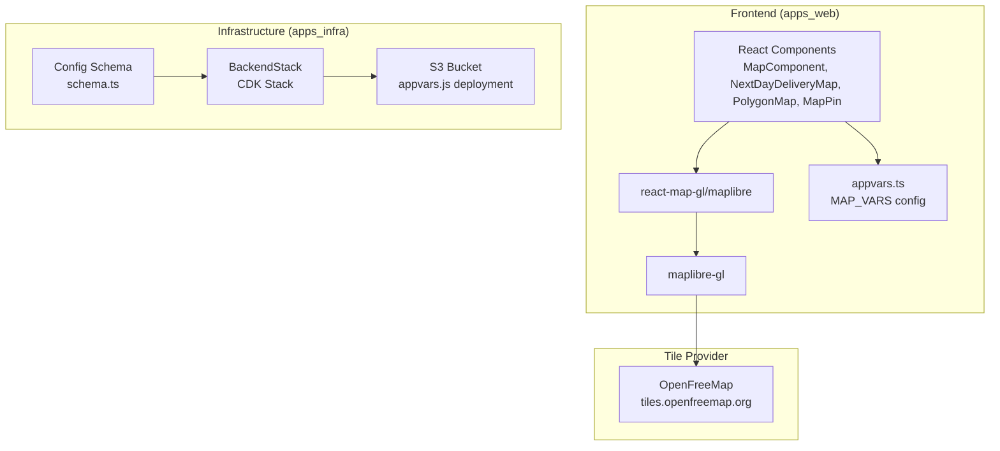
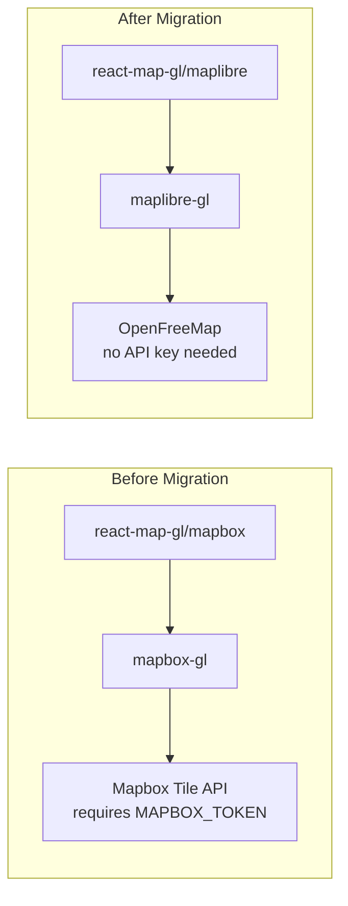
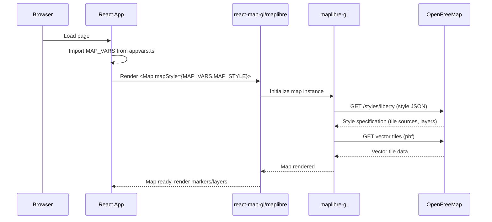
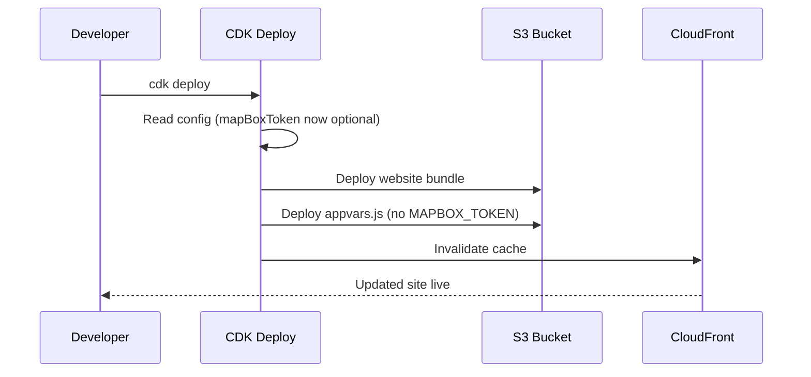

# Design Document: MapLibre Migration

## Overview

This feature migrates the frontend map rendering stack from Mapbox GL JS (proprietary, requires paid API token) to MapLibre GL JS + OpenFreeMap (open-source, no API key required). The migration eliminates the `MAPBOX_TOKEN` dependency that was causing 401/CORS errors due to an invalid placeholder token, replacing it with a free vector tile solution that provides equivalent map rendering capabilities.

The migration leverages the `react-map-gl` library's built-in MapLibre support via its `/maplibre` subpath import, minimizing component-level changes. The `@mapbox/polyline` package is retained as it is a standalone polyline encoding/decoding utility unrelated to Mapbox GL map rendering.

## Architecture





## Sequence Diagrams

### Map Component Initialization Flow



### Infrastructure Deployment Flow



## Components and Interfaces

### Component 1: Map Configuration (appvars.ts)

**Purpose**: Provides centralized map configuration constants to all map components.

**Interface**:
```typescript
export const MAP_VARS: {
  MAP_STYLE: string       // OpenFreeMap style URL
  DEFAULT_LATITUDE: number  // Default center latitude (Seoul station)
  DEFAULT_LONGITUDE: number // Default center longitude (Seoul station)
}
```

**Responsibilities**:
- Provide the OpenFreeMap style URL for all map components
- Define default map center coordinates
- Eliminate need for API token configuration

### Component 2: MapComponent (index.tsx)

**Purpose**: Main map view displaying routes, warehouses, customers, geofences, and polygons.

**Interface**:
```typescript
interface MapInputProps {
  orders?: any[]
  geofences?: any[]
  warehouses?: any[]
  customers?: any[]
}

const MapComponent: FC<MapInputProps>
```

**Responsibilities**:
- Render interactive map with MapLibre GL via react-map-gl/maplibre
- Display route polylines decoded from encoded strings
- Show warehouse, customer, and delivery destination markers
- Render geofence circles and polygon overlays

### Component 3: NextDayDeliveryMap

**Purpose**: Specialized map for displaying a single delivery job's route and stops.

**Interface**:
```typescript
interface NextDayDeliveryMapInputProps {
  segments?: any[]
  route?: any
}

const NextDayDeliveryMap: FC<NextDayDeliveryMapInputProps>
```

**Responsibilities**:
- Display warehouse origin and customer destination markers
- Render the delivery route polyline
- Provide navigation controls and view reset

### Component 4: PolygonMap

**Purpose**: Renders a single polygon overlay on the map (e.g., delivery zones).

**Interface**:
```typescript
interface PolygonMapInputProps {
  vertices: { lat: number; long: number }[]
}

const PolygonMap: FC<PolygonMapInputProps>
```

**Responsibilities**:
- Convert vertex array to GeoJSON polygon
- Render filled polygon with semi-transparent styling

### Component 5: MapPin

**Purpose**: Reusable marker component with popover details.

**Interface**:
```typescript
type MapPinIcon = 'house' | 'person' | 'face' | 'restaurant'

interface IMapPin {
  longitude: number
  latitude: number
  iconName?: MapPinIcon
  data: unknown
  color?: string
}

const MapPin: FC<IMapPin>
```

**Responsibilities**:
- Render positioned marker on the map using MapLibre's Marker
- Display inline SVG icons for different entity types
- Show JSON data popover on click

### Component 6: BackendStack (CDK)

**Purpose**: Deploys the frontend website bundle and runtime configuration to S3.

**Interface**:
```typescript
interface BackendStackProps extends StackProps, Omit<RootConfig, 'env'> {
  readonly persistent: PersistentBackendStack
}
```

**Responsibilities**:
- Deploy website bundle to S3
- Generate `appvars.js` with runtime config (no MAPBOX_TOKEN)
- Manage S3 bucket deployments with proper pruning settings

### Component 7: Config Schema

**Purpose**: Validates infrastructure configuration with Zod schema.

**Interface**:
```typescript
const RootConfigSchema = z.object({
  // ...
  mapBoxToken: z.string().optional(), // Changed from required to optional
  // ...
})
```

**Responsibilities**:
- Validate configuration YAML against schema
- Allow backward-compatible configs that still have mapBoxToken
- Ensure all required fields are present

## Data Models

### Map Configuration Model

```typescript
interface MapConfiguration {
  MAP_STYLE: string       // URL to vector tile style (e.g., OpenFreeMap liberty)
  DEFAULT_LATITUDE: number
  DEFAULT_LONGITUDE: number
}
```

**Validation Rules**:
- `MAP_STYLE` must be a valid HTTPS URL
- `DEFAULT_LATITUDE` must be between -90 and 90
- `DEFAULT_LONGITUDE` must be between -180 and 180

### AppVars Runtime Model (generated by CDK)

```typescript
// Generated as window.appVariables in appvars.js
interface AppVariables {
  REGION: string
  USERPOOL_ID: string
  USERPOOL_CLIENT_ID: string
  API_URL: string
  // MAPBOX_TOKEN removed - no longer needed
}
```

**Validation Rules**:
- All fields are required strings
- `REGION` must be a valid AWS region
- `API_URL` must be a valid HTTPS URL

### Infrastructure Config Model

```typescript
interface RootConfig {
  env: { account: string; region: string }
  namespace: string
  administratorEmail: string
  administratorName: string
  mapBoxToken?: string  // Optional for backward compatibility
  fargateOptions: FargateOptions
  parameterStoreKeys: Record<string, string>
  assets: AssetPaths
}
```

**Validation Rules**:
- `mapBoxToken` is optional (was previously required)
- `account` must be 12-digit string
- `administratorEmail` must be valid email format

## Key Functions with Formal Specifications

### Function 1: Map Initialization

```typescript
function initializeMap(mapStyle: string, defaultLat: number, defaultLng: number): ViewState
```

**Preconditions:**
- `mapStyle` is a valid HTTPS URL pointing to a vector tile style
- `defaultLat` is a number between -90 and 90
- `defaultLng` is a number between -180 and 180

**Postconditions:**
- Returns a valid ViewState with latitude, longitude, zoom, bearing, pitch, and padding
- Map renders without requiring any API token
- Vector tiles load successfully from the style URL

### Function 2: AppVars Generation (CDK)

```typescript
function generateAppVarsContent(
  region: string,
  userPoolId: string,
  userPoolClientId: string,
  apiUrl: string
): string
```

**Preconditions:**
- All parameters are non-empty strings
- `region` is a valid AWS region identifier
- `apiUrl` is a valid URL

**Postconditions:**
- Returns valid JavaScript that assigns to `window.appVariables`
- Output does NOT contain MAPBOX_TOKEN
- Output contains exactly: REGION, USERPOOL_ID, USERPOOL_CLIENT_ID, API_URL

### Function 3: Config Validation

```typescript
function validateConfig(config: unknown): RootConfig
```

**Preconditions:**
- `config` is a parsed YAML/JSON object

**Postconditions:**
- If `mapBoxToken` is present, it is accepted (backward compatibility)
- If `mapBoxToken` is absent, validation still passes
- All other required fields must be present and valid

## Algorithmic Pseudocode

### Migration Algorithm (Package Layer)

```typescript
// Step 1: Remove Mapbox GL dependencies
// package.json changes:
// - Remove: "mapbox-gl", "@types/mapbox-gl"
// - Add: "maplibre-gl": "^5.24.0"
// - Keep: "react-map-gl" (supports both via subpath), "@mapbox/polyline" (unrelated utility)

// Step 2: Update imports in all map components
// Before: import { Map } from 'react-map-gl/mapbox'
// After:  import { Map } from 'react-map-gl/maplibre'

// Before: import 'mapbox-gl/dist/mapbox-gl.css'
// After:  import 'maplibre-gl/dist/maplibre-gl.css'

// Step 3: Remove token prop, update style
// Before: <Map mapboxAccessToken={token} mapStyle="mapbox://styles/mapbox/streets-v11">
// After:  <Map mapStyle={MAP_VARS.MAP_STYLE}>
```

### Configuration Migration Algorithm

```typescript
// Step 1: Update appvars.ts
// Before:
//   export const MAPBOX_VARS = {
//     MAPBOX_TOKEN: requireVariable('MAPBOX_TOKEN'),
//     DEFAULT_LATITUDE: 37.5577857,
//     DEFAULT_LONGITUDE: 126.9697484,
//   }
//
// After:
//   export const MAP_VARS = {
//     MAP_STYLE: 'https://tiles.openfreemap.org/styles/liberty',
//     DEFAULT_LATITUDE: 37.5577857,
//     DEFAULT_LONGITUDE: 126.9697484,
//   }

// Step 2: Update BackendStack - remove MAPBOX_TOKEN from appvars.js generation
// Step 3: Update config schema - make mapBoxToken optional
// Step 4: Remove MAPBOX_TOKEN from appvars.sample.js
```

## Example Usage

```typescript
// Map component usage (after migration)
import { Map, NavigationControl } from 'react-map-gl/maplibre'
import 'maplibre-gl/dist/maplibre-gl.css'
import { appvars } from '../../config'

const { MAP_VARS } = appvars

const MyMap: FC = () => {
  const [viewState, setViewState] = useState<ViewState>({
    latitude: MAP_VARS.DEFAULT_LATITUDE,
    longitude: MAP_VARS.DEFAULT_LONGITUDE,
    zoom: 12,
    bearing: 0,
    pitch: 0,
    padding: { top: 0, right: 0, bottom: 0, left: 0 },
  })

  return (
    <Map
      {...viewState}
      onMove={(e) => setViewState(e.viewState)}
      mapStyle={MAP_VARS.MAP_STYLE}  // No API token needed
      style={{ width: '100%', height: '100%' }}
    >
      <NavigationControl position='top-left' showCompass={false} />
    </Map>
  )
}
```

## Correctness Properties

*A property is a characteristic or behavior that should hold true across all valid executions of a system — essentially, a formal statement about what the system should do. Properties serve as the bridge between human-readable specifications and machine-verifiable correctness guarantees.*

### Property 1: Polyline Decoding Produces Valid GeoJSON

*For any* valid encoded polyline string, decoding via `@mapbox/polyline.toGeoJSON` SHALL produce a valid GeoJSON LineString geometry where all coordinates are `[longitude, latitude]` pairs with longitude in [-180, 180] and latitude in [-90, 90].

**Validates: Requirements 5.1, 6.2**

### Property 2: Config Schema Accepts Optional mapBoxToken

*For any* valid configuration object that includes a `mapBoxToken` field with a string value, the Config_Schema validation SHALL pass without errors.

**Validates: Requirement 8.1**

### Property 3: Config Schema Rejects Missing Required Fields

*For any* required field (env, namespace, administratorEmail, fargateOptions, parameterStoreKeys) removed from an otherwise valid configuration object, the Config_Schema validation SHALL fail with a validation error.

**Validates: Requirement 8.3**

## Error Handling

### Error Scenario 1: OpenFreeMap Unavailable

**Condition**: OpenFreeMap tile server is unreachable or returns errors
**Response**: MapLibre GL displays a blank map canvas with no tiles; map controls remain functional
**Recovery**: Map automatically retries tile requests; no user action required. Consider adding a fallback style URL or error boundary in future iterations.

### Error Scenario 2: Invalid Style URL

**Condition**: `MAP_VARS.MAP_STYLE` points to an invalid or unreachable style JSON
**Response**: MapLibre GL logs a console error; map container renders but shows no content
**Recovery**: Fix the style URL in `appvars.ts` and redeploy

### Error Scenario 3: Legacy Config with mapBoxToken

**Condition**: Existing `default.yml` still contains `mapBoxToken: REPLACE_ME`
**Response**: Zod schema accepts it (field is optional string); value is ignored at runtime
**Recovery**: No action needed — field can be removed at convenience

## Testing Strategy

### Unit Testing Approach

- Verify `MAP_VARS` exports correct style URL and default coordinates
- Verify map components render without `mapboxAccessToken` prop
- Verify `@mapbox/polyline` decoding still works correctly
- Verify config schema accepts configs with and without `mapBoxToken`

### Integration Testing Approach

- Load the web application and verify map tiles render from OpenFreeMap
- Verify all map interactions (pan, zoom, marker clicks) work
- Verify route polylines display correctly on the MapLibre map
- Verify CDK synth produces correct `appvars.js` content without MAPBOX_TOKEN
- Verify CloudFront serves updated `appvars.js` after deployment

### Visual Regression Testing

- Compare map rendering before/after migration for visual parity
- Verify marker icons, polygon fills, and route line styles render correctly

## Performance Considerations

- **Tile Loading**: OpenFreeMap uses the same vector tile format as Mapbox; performance characteristics are similar
- **Bundle Size**: MapLibre GL JS (~700KB) is comparable to Mapbox GL JS; no significant bundle size change
- **CDN**: OpenFreeMap tiles are served via CDN; latency depends on geographic proximity to tile servers
- **No Rate Limiting**: OpenFreeMap has no API key or rate limiting for reasonable usage, eliminating token-related failures

## Security Considerations

- **No API Token Exposure**: Eliminates the risk of exposing a paid Mapbox API token in client-side code
- **No Authentication Required**: OpenFreeMap requires no credentials, removing a secret management concern
- **HTTPS Only**: All tile requests use HTTPS (tiles.openfreemap.org)
- **CSP Headers**: Content Security Policy should allow connections to `tiles.openfreemap.org`

## Dependencies

| Package | Version | Purpose | Change |
|---------|---------|---------|--------|
| `maplibre-gl` | ^5.24.0 | Map rendering engine | Added (replaces mapbox-gl) |
| `react-map-gl` | ^8.1.1 | React wrapper for map GL | Kept (subpath changed to /maplibre) |
| `@mapbox/polyline` | ^1.2.1 | Polyline encoding/decoding | Kept (unrelated to Mapbox GL) |
| `mapbox-gl` | - | Map rendering engine | Removed |
| `@types/mapbox-gl` | - | TypeScript types | Removed |
