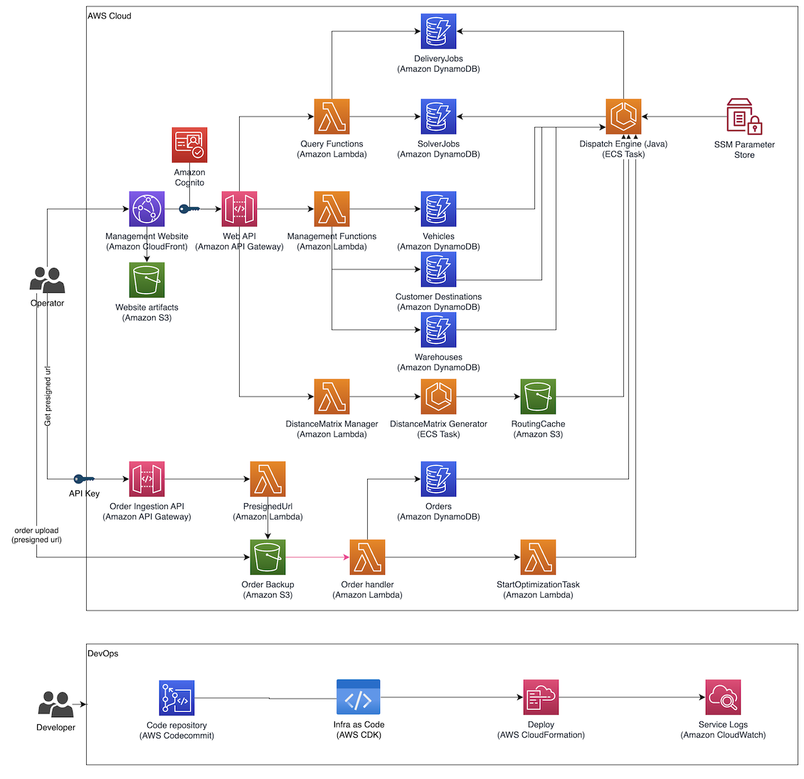
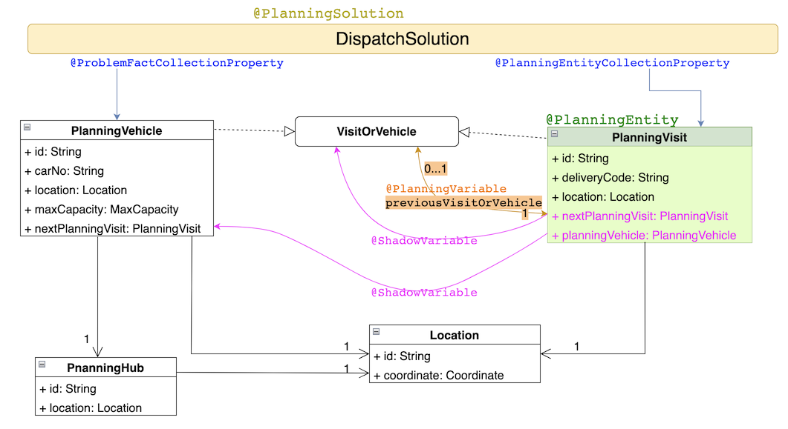

# Architecture

## Solution Architecture



이 프로젝트는 운영자(Operator) 가 웹 UI 로 주문·마스터 데이터를 관리하고, 외부 시스템이 API 로 주문을 업로드하면 백엔드에서 최적화 엔진이 비동기 배치로 배차·경로 최적화를 수행하는 **서버리스 + ECS 하이브리드** 구조입니다. 전체 리소스는 AWS CDK 로 정의되며 5개의 CloudFormation 스택으로 분리되어 배포됩니다(자세한 스택 구성은 [`apps_infra/README.md`](../apps_infra/README.md#stack-architecture) 참조).

다이어그램의 구성요소를 세 영역으로 나누어 설명합니다.

### 1) 운영자(Operator) 경로 — 웹 UI + Web API

- **Management Website (Amazon CloudFront + S3)**
  React 19 기반 SPA(Cloudscape Design + MapLibre) 를 S3("Website artifacts") 에 업로드하고 CloudFront 로 배포합니다. 로그인/UI 렌더링/지도 시각화/CRUD UI 를 담당합니다.
- **Amazon Cognito**
  User Pool 기반 인증. 관리자 계정 생성 시 임시 비밀번호를 이메일로 발송하고, 이후 모든 Web API 호출은 Cognito ID 토큰으로 인증됩니다.
- **Web API (Amazon API Gateway) + Management Functions / Query Functions (AWS Lambda)**
  - **Management Functions** — Warehouses / Vehicles / Customer Destinations / Orders / DistanceMatrix 의 CRUD 를 담당하는 Lambda 집합.
  - **Query Functions** — SolverJobs / DeliveryJobs 등 실행 결과를 조회하는 Lambda 집합.
  - API Gateway 는 Cognito Authorizer 로 보호됩니다.
- **데이터 저장소 (Amazon DynamoDB)**
  각 도메인 객체마다 테이블이 1:1 로 매핑됩니다.
  - `Warehouses` — 창고(출발지) 마스터 데이터
  - `CustomerDestinations` — 배송 대상 고객 위치 + time group, 우선순위
  - `Vehicles` — 자차/계약 차량 마스터 데이터(용량, 등급 등)
  - `Orders` — 당일 업로드된 주문 원장
  - `SolverJobs` — 솔버 실행 이력(상태, 시작/종료 시각, 스코어 등)
  - `DeliveryJobs` — 최적화 결과(차량별 배차 + 방문 순서 + 경로)

### 2) 주문 업로드 경로 — Order Ingestion API (비동기 파이프라인)

외부 시스템은 Web UI 와 별개로 주문 CSV 를 다음 흐름으로 올립니다.

1. **Order Ingestion API (API Gateway + API Key)** 에 `GET` 으로 요청 → **PresignedUrl Lambda** 가 S3 PUT presigned URL 을 반환.
2. 클라이언트가 그 URL 로 주문 CSV 파일을 **Order Backup (Amazon S3)** 에 PUT 업로드.
3. S3 ObjectCreated 이벤트가 **Order handler (Lambda)** 를 트리거 → CSV 파싱 후 `Orders` DynamoDB 테이블에 적재.
4. **StartOptimizationTask (Lambda)** 가 호출되어 ECS 의 Dispatch Engine Task 를 비동기로 실행.

> API Gateway 앞단은 **API Key + Usage Plan** 으로 보호되어 Cognito 와는 별도의 외부 시스템용 인증 경로를 제공합니다.

### 3) 최적화 엔진 경로 — ECS Task 기반 배치 연산

- **DistanceMatrix Manager (Lambda) → DistanceMatrix Generator (ECS Task) → RoutingCache (S3)**
  웹 UI 에서 "Rebuild Distance Cache" 를 실행하면 Manager Lambda 가 Fargate/EC2 ECS Task 를 기동합니다. Task 는 GraphHopper + OSM 데이터로 모든 (창고 ↔ 고객, 고객 ↔ 고객) 간 **도로 기반 거리 매트릭스** 를 계산해 S3 의 RoutingCache 에 직렬화해 두고 DynamoDB 의 distance-cache 메타 테이블을 갱신합니다.
- **Dispatch Engine (ECS Task, Java 21 + Spring Boot + OptaPlanner)**
  주문 업로드나 Web UI 요청으로 트리거됩니다. SSM Parameter Store 에서 테이블 이름·버킷 이름 등 환경 파라미터를 조회하고, DynamoDB 에서 주문/차량/고객 데이터를 읽어 OptaPlanner 로 VRPTW 형태의 최적화 문제를 풀고, 결과(차량별 방문 순서 + 경로) 를 `SolverJobs` / `DeliveryJobs` 테이블에 기록합니다. S3 의 RoutingCache 를 읽어 실제 도로 거리 기반으로 스코어를 계산합니다.
- **SSM Parameter Store**
  각 스택이 생성한 리소스 이름(테이블/버킷/클러스터/ECS Task Definition ARN 등) 을 SSM 파라미터로 내보내고, ECS Task 와 Lambda 가 런타임에 이를 조회합니다. 스택 간 직접적인 참조(Export/Import) 를 피하고 스택 삭제·재배포 시의 **순환 의존성** 을 방지합니다.

### 4) DevOps 파이프라인 (다이어그램 하단)

하단 DevOps 섹션은 개발자 관점의 구성입니다. 원본 다이어그램은 **AWS CodeCommit → AWS CDK → AWS CloudFormation → Amazon CloudWatch** 로 표시되어 있지만, 이 저장소는 CDK 정의만 포함하고 있어 파이프라인 자동화(CodeCommit/Pipeline) 는 포함되어 있지 않습니다.

- **Infra as Code (AWS CDK)** — 저장소의 `apps_infra/` 모듈. `pnpm synth` / `pnpm deploy:dev` 로 로컬에서 배포합니다.
- **Deploy (AWS CloudFormation)** — CDK 가 생성한 템플릿을 CloudFormation 이 프로비저닝.
- **Service Logs (Amazon CloudWatch)** — Lambda / ECS / API Gateway 로그가 기본적으로 CloudWatch Logs 로 수집됩니다.

> 배포·운영 흐름은 [`docs/quickstart.md`](./quickstart.md) 를 참고하세요.

---

## Domain Model



최적화 엔진은 **OptaPlanner** 의 `@PlanningSolution` / `@PlanningEntity` / `@PlanningVariable` / `@ShadowVariable` 어노테이션 기반 모델로 문제를 정의합니다.

- **`DispatchSolution`** — `@PlanningSolution`. 한 번의 솔버 실행에 대응하는 최상위 해(解) 컨테이너. 입력으로 모든 `PlanningVehicle` 과 `PlanningVisit` 을 받고 OptaPlanner 가 계산한 스코어를 함께 보관합니다.
- **`PlanningVehicle`** — `@ProblemFactCollectionProperty` 로 solution 에 주입되는 차량. `id`, `carNo`, 출발 `location`, `maxCapacity`, 체인의 시작점인 `nextPlanningVisit` 를 가집니다. 자차/계약 등 차량 유형과 용량 제약을 나타냅니다.
- **`PlanningVisit`** — `@PlanningEntity`. **방문해야 할 한 건의 배송 지점** 을 의미하며 솔버가 자리(차량 + 방문 순서) 를 결정하는 핵심 엔티티입니다.
  - `@PlanningVariable previousVisitOrVehicle` — 이전 노드로 `PlanningVehicle` 또는 다른 `PlanningVisit` 중 하나를 선택합니다. 이것이 솔버가 실제로 값을 "결정" 하는 변수입니다.
  - `@ShadowVariable nextPlanningVisit` / `planningVehicle` — 이전 노드로부터 역산되는 그림자 변수. 솔버가 이전 체인을 바꾸면 자동으로 갱신됩니다. 스코어 계산과 제약 조건 검사에서 사용됩니다.
- **`VisitOrVehicle`** (인터페이스) — `PlanningVehicle` 과 `PlanningVisit` 이 공통으로 구현합니다. `previousVisitOrVehicle` 이 둘 중 아무거나 가리킬 수 있는 이유입니다. 즉, **각 차량은 한 줄짜리 체인의 머리(head) 이고, 그 뒤에 여러 개의 방문이 줄줄이 이어지는 구조** 로 솔버가 시퀀스를 모델링합니다.
- **`Location`** / **`PlanningHub`** — 실제 물리 위치(`Coordinate`) 를 표현하는 값 객체와, 차량이 출발하는 허브(창고). 거리 계산 시 GraphHopper 기반 거리 매트릭스에 조회 키로 사용됩니다.

체인 구조를 그림으로 간단히 풀면 다음과 같습니다.

```
Vehicle(A) → Visit#1 → Visit#2 → Visit#3 → (end)
Vehicle(B) → Visit#4 → Visit#5 → (end)
Vehicle(C) → (empty, 빈 차량)
```

각 `PlanningVisit` 이 `previousVisitOrVehicle` 로 자기 바로 앞 노드를 가리키는 체인을 구성하며, 솔버는 이 체인을 바꿔 가며 (hard/medium/soft) 스코어가 가장 좋은 조합을 탐색합니다. 주요 제약은 README 의 [Demo Scenario](../README.md#demo-scenario) 에 서술된 비즈니스 규칙(차량 용량, time group 매칭, 자차 우선 배정 등) 이 각각 OptaPlanner Constraint Stream 으로 구현되어 있습니다.
